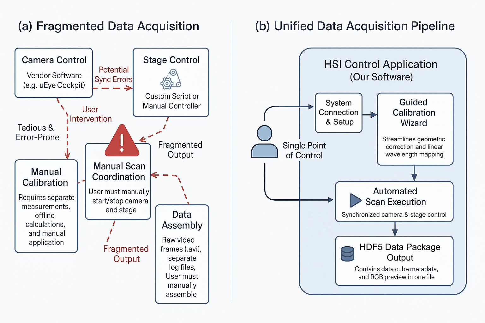
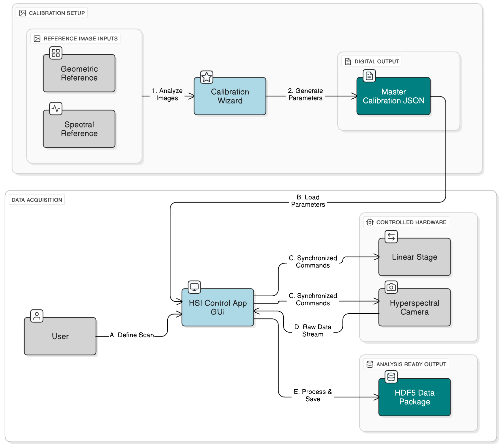
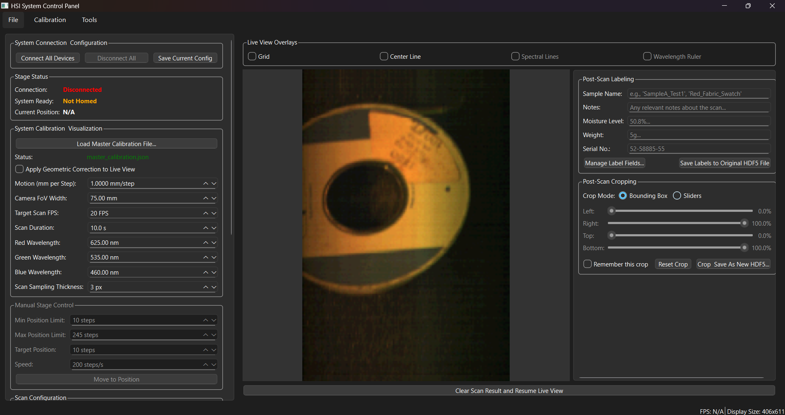
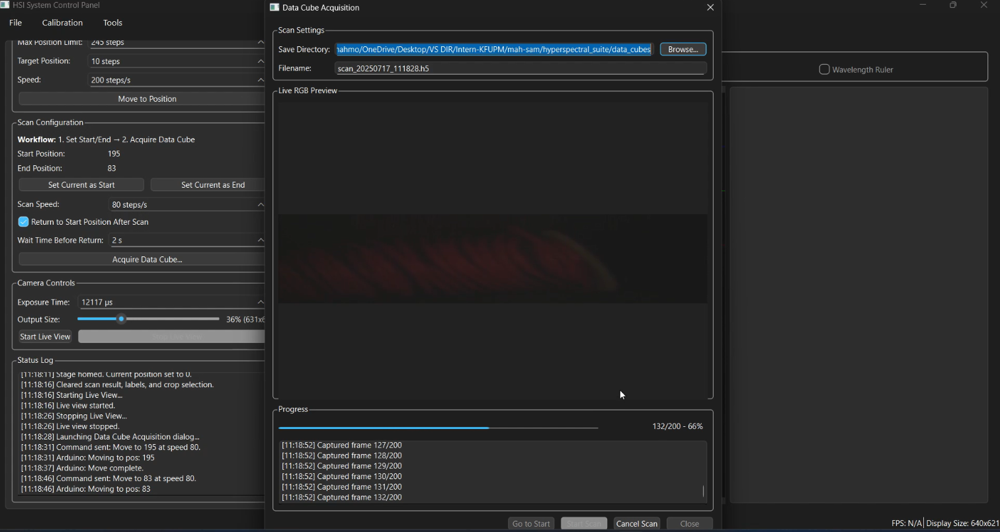
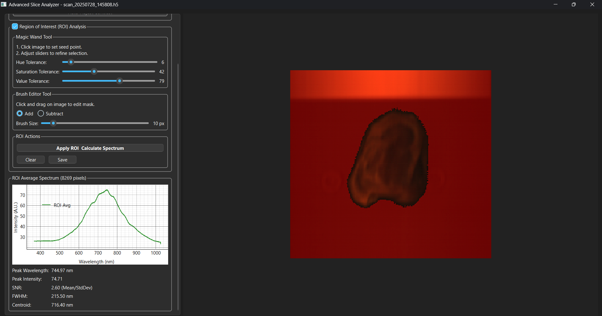

# HSI Control Suite: An Integrated GUI for Operating and Acquiring Data from DIY Push-Broom Hyperspectral Imaging Systems

<div align="center">
  
</div>
    
<p align="center">
  <strong>Unified Control, Initial Calibration, and Data Acquisition for DIY Benchtop Push-Broom Hyperspectral Imaging Systems</strong>
</p>

<p align="center">
  <a href="https://github.com/mah-sam/benchtop-hsi-control/releases/latest"></a>
  
  
  
  
  
</p>

---

## Table of Contents

- [1. Introduction](#1-introduction)
- [2. From Hardware Blueprint to Usable Instrument](#2-from-hardware-blueprint-to-usable-instrument)
- [3. The Problem: A Fragmented Workflow](#3-the-problem-a-fragmented-workflow)
- [4. Our Solution: Key Features](#4-our-solution-key-features)
- [5. Scope and Future Work](#5-scope-and-future-work)
- [6. System Architecture](#6-system-architecture)
- [7. Gallery](#7-gallery)
- [8. Hardware Requirements](#8-hardware-requirements)
- [9. Installation](#9-installation)
  - [A. From Executable (Recommended for End-Users)](#a-from-executable-recommended-for-end-users)
  - [B. From Source (Recommended for Developers)](#b-from-source-recommended-for-developers)
  - [C. Building the Executable (Advanced)](#c-building-the-executable-advanced)
- [10. Testing with Sample Data](#10-testing-with-sample-data)
  - [A. Testing the Calibration Wizard](#a-testing-the-calibration-wizard)
  - [B. Testing the Analysis Tools](#b-testing-the-analysis-tools)
- [11. Usage Workflow](#11-usage-workflow)
- [12. Output Data Format: HDF5 Structure](#12-output-data-format-hdf5-structure)
- [13. Adapting for Custom Hardware](#13-adapting-for-custom-hardware)
  - [A. Adapting the Stage Controller](#a-adapting-the-stage-controller)
  - [B. Adapting the Camera Controller](#b-adapting-the-camera-controller)
- [14. Contributing](#14-contributing)
- [15. License](#15-license)
- [16. Acknowledgments & Citation](#16-acknowledgments--citation)

---

## 1. Introduction

The **HSI Control Suite** is a complete, open-source software application designed to manage the entire data acquisition pipeline for custom-built, benchtop push-broom hyperspectral imaging (HSI) systems. Developed in Python with a professional PyQt6 graphical user interface (GUI), this suite addresses the significant challenges of cost, operational complexity, and fragmented software workflows that often hinder HSI research.

The primary outcome is a fully validated acquisition platform that streamlines the workflow from hardware setup to the generation of analysis-ready data packages, enabling researchers to create high-quality, reproducible hyperspectral datasets with ease.

## 2. From Hardware Blueprint to Usable Instrument

This software project is the direct software counterpart and operational framework for the hardware system detailed in this publication:

**[Hardware Paper](https://opg.optica.org/optcon/fulltext.cfm?uri=optcon-1-2-427&id=469515)** - *Do-it-yourself VIS/NIR pushbroom hyperspectral imager with C-mount optics*

The hardware paper provides a comprehensive blueprint for constructing a low-cost, high-performance push-broom HSI system from COTS components. While it details the physical assembly and validates the optical design, a functional hardware setup is only half of a complete instrument. Without a sophisticated control layer, the hardware remains a collection of parts that cannot perform the critical, synchronized tasks required for valid data acquisition.

The **HSI Control Suite** was developed to bridge this crucial gap. It serves as the "brain and central nervous system" for the hardware "body," transforming the validated physical components into a fully integrated and usable scientific instrument. A critical component of this integration is the custom **Arduino firmware** that runs the linear stage. This firmware acts as an intelligent, real-time motion controller, offloading the complex task of stepper motor control from the host PC. Upon startup, it performs an automated homing sequence to dynamically calibrate its operational range. It then communicates with the Python application via a robust binary serial protocol, translating high-level, normalized position commands into precise physical movements with smooth acceleration. This intelligent firmware decouples the main software from the physical hardware dimensions, ensuring reliable and repeatable scans.

---

## 3. The Problem: A Fragmented Workflow

Hyperspectral imaging is a powerful technique, but building and operating a custom system is notoriously complex. Researchers often face a fragmented and inefficient workflow, relying on a patchwork of disconnected tools:
- **Manufacturer SDKs:** Low-level, command-line tools for basic camera control.
- **Custom Scripts:** Separate Python or MATLAB scripts to control motorized stages.
- **Manual Synchronization:** Error-prone manual coordination between camera capture and stage movement.
- **Separate Calibration Software:** Complex, offline tools for geometric and spectral correction.
- **Post-Processing Hassles:** Manually assembling data cubes and adding metadata in yet another software environment.

This fragmentation creates a steep learning curve, introduces opportunities for error, and hinders the creation of consistent, high-quality datasets.

<div align="center">
  
  <br>
  <em>Figure 1: Conceptual comparison between the common fragmented HSI workflow and the integrated, streamlined workflow enabled by the HSI Control Suite.</em>
</div>

## 4. Our Solution: Key Features

The HSI Control Suite is designed from the ground up to solve these problems by providing a seamless, end-to-end solution.

- **Unified Graphical User Interface (GUI):** A professional and intuitive interface built with PyQt6 provides a central control panel for all system operations, eliminating the need for command-line interaction.

- **Integrated Hardware Control:** Seamless, multi-threaded control of both the hyperspectral camera (via Spinnaker SDK) and the linear motion stage (via Arduino/Serial communication).

- **Guided Calibration Wizard:** A step-by-step wizard that guides the user through the entire geometric and spectral calibration process, generating a master calibration file that ensures data accuracy and consistency.

- **Automated & Synchronized Acquisition:** A dedicated acquisition dialog automates the entire push-broom scan. It precisely synchronizes camera frame capture with stage motion based on user-defined parameters (speed, duration, FPS), ensuring geometrically correct data cubes.

- **Real-Time Corrected Live View:** A critical feature for push-broom systems. The live camera feed is geometrically corrected in real-time using the calibration data, allowing for accurate sample positioning and focusing.

- **Robust HDF5 Data Management:** Scans are saved as single, self-describing HDF5 files. Each file contains:
    - The full hyperspectral data cube.
    - A complete set of acquisition metadata (camera settings, scan parameters, etc.).
    - User-defined labels for sample tracking and ground-truth data.
    - An automatically generated RGB preview for quick qualitative assessment.

- **Integrated Post-Processing & Analysis Tools:**
    - **Post-Scan Labeling:** Immediately add or edit metadata labels in the saved HDF5 file without needing external tools.
    - **Interactive Cropping:** Define a spatial region of interest on the scan preview and save a new, smaller data cube.
    - **Advanced Slice Analyzer:** An interactive dialog to explore the data cube slice-by-slice, plot spectra from any pixel, and perform robust Region of Interest (ROI) analysis using "Magic Wand" and brush tools.

- **Open-Source and Extensible:** The entire codebase is written in Python, making it easy to modify, extend, or integrate with other scientific libraries.

## 5. Scope and Future Work

The HSI Control Suite is designed primarily as a robust **data acquisition engine**. Its main goal is to solve the immediate and complex challenge of synchronized hardware control, guided calibration, and the generation of pristine, well-documented raw data cubes.

While the current version provides essential post-processing tools (labeling, cropping, ROI analysis), more advanced calibration and data conversion steps are planned as future enhancements.

-   **Radiometric Calibration:** Converting the raw data to absolute reflectance using white/dark references is a critical step for many quantitative studies. This is often an offline, post-processing task that requires the same raw data that our system already captures. Future work will involve integrating a dedicated module to perform this calibration on the saved HDF5 files.
-   **ENVI File Support:** The HDF5 format was chosen for its ability to store all data and metadata in a single, self-describing file. However, the ENVI format is a standard in the HSI community. A future update will include a utility to export the data from HDF5 files to the ENVI format, enhancing interoperability with other analysis tools like ENVI® and Vespucci.

The current architecture ensures that users can acquire the necessary high-quality raw data today, which remains fully compatible with these future post-processing workflows.

## 6. System Architecture

The software is built on a modular, multi-threaded architecture to ensure a responsive user experience and reliable hardware communication. The GUI interacts with a hardware abstraction layer, which manages the low-level communication with the camera and stage on separate threads.

<div align="center">
  
  <br>
  <em>Figure 2: High-level software architecture of the HSI Control Suite.</em>
</div>

## 7. Gallery

<table align="center">
  <tr>
    <td align="center">
      
      <br><em>Figure 3: The main control panel, showing the real-time corrected live view and hardware control modules.</em>
    </td>
    <td align="center">
      
      <br><em>Figure 4: The automated acquisition dialog with advanced save options and a live RGB preview of the ongoing scan.</em>
    </td>
  </tr>
  <tr>
    <td colspan="2" align="center">
      
      <br><em>Figure 5: The Advanced Slice Analyzer, showing an interactive spectral slice with a user-defined Region of Interest (ROI) and the resulting averaged spectrum.</em>
    </td>
  </tr>
</table>

## 8. Hardware Requirements

This software is designed to control a specific set of COTS and custom-fabricated hardware. While adaptable, the default configuration requires:

- **Camera:** A FLIR (formerly Point Grey) machine vision camera compatible with the **Spinnaker SDK**. (Tested with FLIR Grasshopper3).
- **Linear Stage:** A stepper motor-driven linear stage.
- **Stage Controller:** An **Arduino Uno** (or compatible board) running custom firmware to control a stepper motor driver (e.g., A4988, DRV8825).
- **Motor:** A **NEMA-17** stepper motor.
- **Illumination:** Stable, broad-spectrum lighting (e.g., halogen lamps).

## 9. Installation

You can run the HSI Control Suite either from a pre-built executable or by running the source code directly.

### A. From Executable (Recommended for End-Users)

1.  Navigate to the [**Releases**](https://github.com/mah-sam/benchtop-hsi-control/releases/latest) page of this repository.
2.  Download the latest installer or the zipped executable package.
3.  Run the installer or extract the zip file.
4.  Launch the `.exe` file.

### B. From Source (Recommended for Developers)

**Prerequisites:**
- Python 3.10 or newer.
- **Crucial:** You must install the **FLIR Spinnaker SDK** from the official FLIR website. Make sure to install the Python bindings (`PySpin`) in the virtual environment you'll be creating in the next steps from the [FLIR website](https://www.teledynevisionsolutions.com/products/spinnaker-sdk/). (specifically for python 3.10).

**Steps:**

1.  **Clone the repository:**
    ```bash
    git clone https://github.com/mah-sam/benchtop-hsi-control.git
    cd benchtop-hsi-control
    ```

2.  **Create and activate a virtual environment:**
    ```bash
    # Windows
    python -m venv venv
    .\venv\Scripts\activate

    # macOS / Linux
    python3 -m venv venv
    source venv/bin/activate
    ```

3.  **Install the required Python packages:**
    ```bash
    pip install -r requirements.txt
    ```

4.  **Run the application:**
    ```bash
    python hsi_control_v5.py
    ```

### C. Building the Executable (Advanced)

For developers who wish to compile a standalone, distributable version of the application, this project includes a pre-configured `setup.py` file for use with **cx_Freeze**.

#### Prerequisites

1.  Ensure you have followed the steps in the **[From Source](#b-from-source-recommended-for-developers)** section to set up a Python virtual environment and install all dependencies from `requirements.txt`.
2.  Install `cx_Freeze` in your activated virtual environment:
    ```bash
    pip install cx_freeze
    ```

#### Build Process

1.  Open a terminal or command prompt and navigate to the root directory of the project.
2.  Ensure your virtual environment is activated.
3.  Run the build command:
    ```bash
    python setup.py build
    ```
4.  The build process will begin. If successful, the standalone application will be located in the newly created `build/` directory, inside a folder specific to your platform (e.g., `build/exe.win-amd64-3.10`).

#### Creating a Windows Installer (MSI)

To create a user-friendly MSI installer on Windows, use the `bdist_msi` command:
```bash
python setup.py bdist_msi
```
The resulting `.msi` file will be located in the `dist/` directory.

#### Pre-compiled Releases

For convenience, pre-compiled executable for Windows is available on the project's **Releases page**. This is the recommended method for users who do not need to modify the source code.

-   **[Download the latest release here](https://github.com/mah-sam/benchtop-hsi-control/releases/latest)**

## 10. Testing with Sample Data

To allow users to test the full functionality of the HSI Control Suite without needing the physical hardware, a complete set of sample data is provided in the `/sample_data/` directory.

### A. Testing the Calibration Wizard

You can run the entire calibration process using the provided sample images.

1.  Launch the HSI Control Suite application.
2.  Navigate to `Calibration > Run Calibration Wizard...`.
3.  Follow the wizard's steps, using the specified files at each prompt:
    *   **Step 1: Straightening:** When prompted for an image with vertical lines to correct for tilt, select:
        `sample_data/calibration/white_stripes.png`
    *   **Step 2: Cropping:** When prompted for an image to define the sensor's active area, select:
        `sample_data/calibration/exposed_sensor.png`
    *   **Step 3: Spectral Calibration:** The wizard will ask you to load images of known wavelengths to create a wavelength-to-pixel map. For each prompt, load the corresponding file and enter its wavelength value:
        - Load `sample_data/calibration/460nm.png` and enter `460`.
        - Load `sample_data/calibration/560nm.png` and enter `560`.
        - Load `sample_data/calibration/660nm.png` and enter `660`.
        - Load `sample_data/calibration/910nm.png` and enter `910`.
4.  Upon completion, the wizard will successfully generate a `master_calibration.json` file, demonstrating that the calibration logic is working correctly.

### B. Testing the Analysis Tools

You can test the post-processing and analysis features using the pre-acquired hyperspectral data cubes.

1.  In the main application, go to `Tools > Advanced Slice Analyzer...`.
2.  In the Slice Analyzer window, go to `File > Open HDF5 Data Cube...`.
3.  Select one of the sample cubes, for example:
    `sample_data/sample_cubes/scan_20250803_155324_cropped.h5`
4.  The data cube will load, and you can now test all the features of the analyzer:
    *   Navigate through spectral slices.
    *   Click on any pixel to plot its spectrum.
    *   Use the "Magic Wand" and brush tools to define a Region of Interest (ROI) and view the averaged spectrum.

## 11. Usage Workflow

The software is designed to guide the user through a logical workflow:

1.  **Connect Hardware:** Use the "Connect All Devices" button in the main GUI to establish communication with the camera and stage controller.
2.  **Perform Calibration (First-Time Use):**
    - Go to `Calibration > Run Calibration Wizard...`.
    - Follow the on-screen instructions for each step (Straightening, Cropping, Spectral Calibration).
    - The wizard will generate a `master_calibration.json` file in the `assets` directory. The main application will load this automatically on startup.
3.  **Set Scan Parameters:**
    - Manually move the stage to the desired start and end positions and click "Set Current as Start" and "Set Current as End".
    - Configure the scan speed and other parameters in the "Scan Configuration" panel.
4.  **Acquire Data Cube:**
    - Click "Acquire Data Cube..." to open the acquisition dialog.
    - Fill in any necessary metadata labels.
    - Choose a save location and filename.
    - Click "Start Scan" to begin the automated acquisition process.
5.  **Analyze and Process:**
    - After the scan, the RGB preview will appear in the main window.
    - Use the "Post-Scan Labeling" and "Post-Scan Cropping" tools as needed.
    - For in-depth analysis, launch the "Advanced Slice Analyzer" from the `Tools` menu and open the newly created HDF5 file.

## 12. Output Data Format: HDF5 Structure

The HSI Control Suite produces a single, comprehensive HDF5 file for each scan, ensuring data integrity and portability. The internal structure is as follows:

```
/ (Root Group)
├── Attributes:
│   ├── 'metadata': (String) A JSON-formatted string containing all acquisition parameters,
│   │               calibration info, timestamps, etc.
│   ├── 'labels': (String) A JSON-formatted string with user-defined key-value pairs.
│   └── 'roi_settings': (String, Optional) JSON string with parameters used to generate a saved ROI.
│
├── Datasets:
│   ├── 'cube': (Dataset, float32) The main hyperspectral data cube.
│   │           Shape: (spectral_height, spatial_width, num_bands)
│   │           Dimensions: (Spectral Axis, Spatial Axis, Scan Axis)
│   │
│   ├── 'rgb_preview': (Dataset, uint8) The 3-channel RGB preview image.
│   │                  Shape: (scan_length_pixels, spatial_width_pixels, 3)
│   │
│   └── 'roi_mask': (Dataset, bool, Optional) A 2D boolean mask defining a saved ROI.
│                   Shape: (scan_length_pixels, spatial_width_pixels)
```

---

## 13. Adapting for Custom Hardware

The HSI Control Suite is intentionally designed with a modular architecture to facilitate its use in diverse laboratory settings. Both the camera and stage controllers function as **Hardware Abstraction Layers (HALs)**. This means they encapsulate all hardware-specific communication logic, presenting a simple, consistent interface to the main application. You can replace the default implementations to support different hardware without altering the core GUI code.

This section provides a guide for adapting both the stage and camera controllers.

### A. Adapting the Stage Controller

The HSI Control Suite is intentionally designed to be modular. The `StageController` class in `hardware/stage_controller.py` acts as a "translator" between the main graphical user interface (GUI) and the physical linear stage. This design allows you to replace the default Arduino-based control logic with a new implementation for your specific hardware (e.g., a commercial stage from Thorlabs, Zaber, Newport, etc.) without modifying the rest of the application.

This guide explains the purpose of each key method in the `StageController` and the requirements your new code must meet to ensure seamless integration.

#### The "API Contract": What the GUI Expects

To function correctly, the main application requires the `StageController` to provide a specific set of methods and signals. Think of this as a contract. As long as your modified class honors this contract, the GUI will work perfectly with your custom hardware.

**Your custom controller MUST provide:**

*   **Methods:** `connect()`, `disconnect()`, `move_to(position, speed)`
*   **Signals:** `status_update(str)`, `homing_complete()`, `connection_lost()`

---

### Step-by-Step Modification Guide

#### 1. The `connect()` Method

*   **Goal:** To establish a connection with your hardware and perform any necessary initialization, such as homing. The GUI calls this method when the user clicks "Connect All Devices."

*   **What to Replace:** The entire logic inside the `connect()` and `_find_arduino_port()` methods. The current code specifically scans serial ports for an Arduino and waits for it to reset. This is unique to the default hardware.

*   **Your Replacement Code Must:**
    1.  Contain all the necessary steps to find and open a communication channel to your hardware (e.g., opening a specific COM port, connecting via a vendor's SDK, etc.).
    2.  Trigger the hardware's homing or initialization sequence. This is essential for establishing a reliable zero position.
    3.  **Crucially**, upon successful connection and completion of homing, it must set `self.is_connected = True` and `self.is_homed = True`.
    4.  **It must emit the `homing_complete` signal.** The GUI's motion controls are disabled until this signal is received. This tells the rest of the application that the stage is ready for commands.
    5.  Emit `status_update` signals to provide feedback to the user in the log window (e.g., "Connecting to Zaber Stage...", "Homing complete.").
    6.  Return `True` on success and `False` on failure.

*   **Example (using a hypothetical vendor SDK):**
    ```python
    def connect(self):
        try:
            # Step 1: Establish communication
            from vendor_sdk import Stage
            self.stage_device = Stage.connect("SERIAL_NUMBER_XYZ")
            self.status_update.emit("Successfully connected to MyStage.")

            # Step 2: Initialize and home the device
            self.status_update.emit("Homing stage... Please wait.")
            self.stage_device.home() # This is a blocking call that waits for homing to finish

            # Step 3 & 4: Update state and notify the GUI
            self.is_connected = True
            self.is_homed = True
            self.homing_complete.emit() # CRITICAL: This unlocks the GUI controls
            self.status_update.emit("Stage is homed and ready.")
            
            # Step 6: Return success
            return True
        except Exception as e:
            self.status_update.emit(f"Error connecting to stage: {e}")
            return False
    ```

#### 2. The `move_to(position, speed)` Method

*   **Goal:** To translate an abstract position and speed command from the GUI into a physical movement command for your hardware.

*   **A Note on Normalization:** The GUI uses a normalized `position` range of **10 to 250** and a `speed` range of **50 to 1000**. This is intentional. It decouples the GUI from the physical dimensions of any specific stage. Your job in this method is to map these abstract numbers to the real-world units your stage uses (e.g., millimeters, steps, mm/s).

*   **What to Replace:** The binary packing logic inside the `move_to()` method. The `struct.pack` command creates a 3-byte packet specifically for the Arduino firmware.
    ```python
    # REMOVE THIS ARDUINO-SPECIFIC CODE
    command_packet = struct.pack('<BH', position, speed)
    self.serial.write(command_packet)
    ```

*   **Your Replacement Code Must:**
    1.  Perform a mathematical mapping from the input `position` (10-250) to a physical position that your hardware understands.
    2.  (If necessary) Perform a similar mapping for the input `speed`.
    3.  Send the resulting physical command to your hardware using its specific protocol (e.g., an SDK function call or a serial command string).
    4.  Include error handling in case the command fails (e.g., the device was disconnected).

*   **Example (mapping to a 150mm stage):**
    ```python
    def move_to(self, position: int, speed: int = 100):
        if not self.is_connected or not self.is_homed:
            self.status_update.emit("Error: Stage not ready for move commands.")
            return

        # --- Step 1: Map the normalized position ---
        # Define physical limits of your stage (e.g., in mm)
        MIN_PHYSICAL_POS = 0.0
        MAX_PHYSICAL_POS = 150.0

        # Linear mapping from GUI range (10-250) to physical range
        normalized_range = 250 - 10
        physical_range = MAX_PHYSICAL_POS - MIN_PHYSICAL_POS
        scale = physical_range / normalized_range
        target_mm = MIN_PHYSICAL_POS + ((position - 10) * scale)

        # --- Step 2: Map speed (optional, depends on hardware) ---
        target_speed_mms = speed / 10.0 # Example: map 50-1000 to 5-100 mm/s

        # --- Step 3: Send the command ---
        try:
            self.status_update.emit(f"Moving to {target_mm:.2f} mm at {target_speed_mms} mm/s.")
            self.stage_device.move_absolute(target_mm, speed=target_speed_mms)
        except Exception as e: # Catch potential communication errors
            self.status_update.emit(f"Error sending move command: {e}")
            self.connection_lost.emit() # Notify GUI of the failure
    ```

#### 3. The `disconnect()` Method

*   **Goal:** To safely close the connection to the hardware and clean up any resources.

*   **What to Replace:** The Arduino-specific logic (stopping the reader thread, closing the serial port).

*   **Your Replacement Code Must:**
    1.  Call the appropriate function to safely disconnect from your hardware (e.g., `device.disconnect()`, `serial.close()`).
    2.  Reset the internal state flags: `self.is_connected = False` and `self.is_homed = False`.

#### 4. Handling Asynchronous Feedback (`SerialReaderThread`)

*   **Goal:** The `SerialReaderThread` exists because the Arduino sends messages (like "System ready") at its own pace, independently of commands sent from the PC. The thread listens for these messages without freezing the GUI.

*   **Does Your Hardware Need This?**
    *   **NO (Synchronous Communication):** If your hardware's commands (like `stage.home()`) are *blocking*—meaning your Python code waits until the action is finished before continuing—then you **do not need a reader thread**. You can safely delete the `SerialReaderThread` class and all references to it (`_start_reader_thread`, `_handle_serial_data`). This is the simpler and more common scenario for commercial SDKs.
    *   **YES (Asynchronous Communication):** If your hardware sends back status messages or error codes spontaneously, you will need a similar mechanism. You would keep the thread but modify the `_handle_serial_data` method to parse the specific messages your device sends.

### B. Adapting the Camera Controller

Similar to the stage controller, the `CameraController` class in `camera_controller.py` is a hardware abstraction layer. It encapsulates all the complex, hardware-specific logic for communicating with a FLIR camera via the Spinnaker SDK. This modular design allows you to substitute the default implementation to support other cameras—such as those from Basler (using Pylon), Allied Vision (using Vimba), or even a standard webcam (using OpenCV)—without altering the main application's code.

This guide explains the purpose of each key method in the `CameraController` and the requirements your new code must meet to integrate a different camera system.

#### The "API Contract": What the GUI Expects

The main application relies on the `CameraController` to provide a consistent interface for camera operations. To ensure drop-in compatibility, your custom controller class must honor this "API contract."

**Your custom controller MUST provide:**

*   **Methods:**
    *   `connect()`
    *   `disconnect()`
    *   `set_exposure_time(exposure_us)`
    *   `start_live_view()`
    *   `stop_live_view()`
*   **Signals (must be defined in your class):**
    *   `status_update(str)`: For sending log messages.
    *   `new_live_frame(object)`: Emits a new camera frame as a NumPy array. **This is the most critical signal for all visual feedback.**
    *   `exposure_time_updated(float)`: Emits the actual exposure value after it has been set.
    *   `connection_lost(str)`: For error handling.

The aggregation and bulk acquisition features rely on the fundamental methods listed above. If you implement them correctly, the more advanced features will function automatically.

---

### Step-by-Step Modification Guide

#### 1. The `connect()` Method

*   **Goal:** To find the camera, establish a connection, and configure it to a known default state (e.g., continuous acquisition mode, monochrome pixel format).

*   **What to Replace:** The entire body of the `connect()` method. The current code is entirely Spinnaker-specific, using `System.GetInstance()`, `GetCameras()`, and `cam.Init()`.

*   **Your Replacement Code Must:**
    1.  Use the appropriate library (e.g., `pylon`, `cv2`, or a vendor SDK) to detect and initialize your camera.
    2.  Configure the camera to a state suitable for this application: typically continuous frame acquisition and a monochrome pixel format (e.g., `Mono8`).
    3.  Set the internal state flag `self.is_connected = True`.
    4.  Emit `status_update` signals to inform the user of the connection progress.
    5.  Return `True` on success and `False` on failure.

*   **Example (using OpenCV for a generic USB camera):**
    ```python
    import cv2
    
    # In your modified CameraController class
    def connect(self):
        try:
            # Step 1: Initialize the camera (0 is usually the default webcam)
            self.cap = cv2.VideoCapture(0, cv2.CAP_DSHOW) 
            if not self.cap.isOpened():
                self.status_update.emit("Error: Could not open video stream.")
                return False

            # Step 2: Configure camera properties
            self.cap.set(cv2.CAP_PROP_CONVERT_RGB, 0) # Request grayscale frames
            self.cap.set(cv2.CAP_PROP_FRAME_WIDTH, 1280)
            self.cap.set(cv2.CAP_PROP_FRAME_HEIGHT, 720)

            # Step 3 & 4: Update state and notify user
            self.is_connected = True
            self.status_update.emit("Generic USB camera connected successfully.")
            
            # Step 5: Return success
            return True
        except Exception as e:
            self.status_update.emit(f"Camera connection error: {e}")
            return False
    ```

#### 2. Camera Parameter Control (e.g., `set_exposure_time`)

*   **Goal:** To provide a standardized way for the GUI to control camera settings. The most important setting is exposure time.

*   **What to Replace:** The body of `set_exposure_time()`. The current code manipulates Spinnaker's GenICam nodes (`CFloatPtr`, `SetValue`). This is highly specific.

*   **Your Replacement Code Must:**
    1.  Accept the exposure time in **microseconds** (`exposure_us`), as this is the unit the GUI uses.
    2.  Use your camera's API to set the exposure. You may need to convert the units (e.g., to milliseconds).
    3.  After setting the value, read it back from the hardware to get the *actual* value set, as cameras often adjust to the nearest valid setting.
    4.  **Crucially, it must emit the `exposure_time_updated` signal** with the actual value. This keeps the GUI slider synchronized with the hardware.

*   **Example (using OpenCV):**
    ```python
    def set_exposure_time(self, exposure_us: float):
        if not self.is_connected: return False
        try:
            # Step 1 & 2: Convert units and set value
            # OpenCV's exposure property is an exponent (-7 corresponds to ~7.8ms)
            # This is just an example; your SDK will have a more direct method.
            # For a real SDK, it might be: self.cam_device.Exposure.SetValue(exposure_us)
            
            # For OpenCV, we'll pretend we can set it in ms
            exposure_ms = exposure_us / 1000.0
            self.cap.set(cv2.CAP_PROP_EXPOSURE, exposure_ms)

            # Step 3 & 4: Read back the value and emit the signal
            actual_exposure_ms = self.cap.get(cv2.CAP_PROP_EXPOSURE)
            actual_exposure_us = actual_exposure_ms * 1000.0
            self.exposure_time_updated.emit(actual_exposure_us) # CRITICAL
            
            self.status_update.emit(f"Exposure set to {actual_exposure_us:.2f} µs.")
            return True
        except Exception as e:
            self.status_update.emit(f"Error setting exposure: {e}")
            return False
    ```

#### 3. Frame Acquisition (`start_live_view`, `stop_live_view`, and `_capture_frame_for_processing`)

*   **Goal:** This set of methods controls the flow of images from the camera to the application. `start/stop_live_view` turns the stream on and off, while `_capture_frame_for_processing` is the workhorse that grabs each individual frame.

*   **What to Replace:** The Spinnaker-specific calls within these three methods.
    *   In `start/stop_live_view`: `cam.BeginAcquisition()` and `cam.EndAcquisition()`.
    *   In `_capture_frame_for_processing`: The entire `try...except` block containing `cam.GetNextImage()`, `GetNDArray()`, and `Release()`.

*   **Your Replacement Code Must:**
    1.  In `start_live_view()`: Contain the command to start your camera's video stream. The use of a `QTimer` to periodically call `_capture_frame_for_processing` is a hardware-agnostic pattern and should be kept.
    2.  In `stop_live_view()`: Contain the command to stop the stream.
    3.  In `_capture_frame_for_processing()`: This is the most important part. This method must perform a single action: **grab one frame from the camera and emit it as a NumPy array via the `new_live_frame` signal.** If this works, the live view, real-time correction, and aggregation will all function correctly.

*   **Example (using OpenCV):**
    ```python
    # In start_live_view():
    # No specific command needed for OpenCV, opening the stream is enough.
    # Just start the QTimer.
    self._live_view_timer.start()
    self.status_update.emit("Live view started.")

    # In stop_live_view():
    self._live_view_timer.stop()
    self.status_update.emit("Live view stopped.")

    # In _capture_frame_for_processing():
    def _capture_frame_for_processing(self):
        try:
            ret, frame = self.cap.read() # Grab one frame
            if ret:
                # OpenCV returns BGR by default, convert to grayscale
                gray_frame = cv2.cvtColor(frame, cv2.COLOR_BGR2GRAY)
                
                # The contract: emit a NumPy array
                self.new_live_frame.emit(gray_frame)
        except Exception:
            self.connection_lost.emit("Camera disconnected during capture.")
            self.stop_live_view()
    ```

#### 4. The `disconnect()` Method

*   **Goal:** To release the camera hardware and clean up all associated resources.

*   **What to Replace:** The entire body of the method, which contains Spinnaker-specific de-initialization and cleanup calls.

*   **Your Replacement Code Must:**
    1.  Call the function from your camera's API to release the hardware.
    2.  Reset the internal state flag: `self.is_connected = False`.

*   **Example (using OpenCV):**
    ```python
    def disconnect(self):
        if self.is_acquiring:
            self.stop_live_view()
        
        if hasattr(self, 'cap') and self.cap.isOpened():
            self.cap.release() # Release the camera hardware
        
        self.is_connected = False
        self.status_update.emit("Camera disconnected.")
    ```

By methodically replacing the Spinnaker-specific logic while adhering to the established API contract, you can integrate virtually any machine vision camera into the HSI Control Suite.

## 14. Contributing

Contributions are welcome! If you would like to contribute to the project, please follow these steps:
1.  Fork the repository.
2.  Create a new branch for your feature (`git checkout -b feature/AmazingFeature`).
3.  Commit your changes (`git commit -m 'Add some AmazingFeature'`).
4.  Push to the branch (`git push origin feature/AmazingFeature`).
5.  Open a Pull Request.

Please report any bugs or suggest features by opening an issue on the GitHub repository.

## 15. License

This project is licensed under the MIT License. See the [LICENSE](LICENSE) file for details.

## 16. Acknowledgments & Citation

This research was supported by the Undergraduate Research Office and Electrical Engineering Department at King Fahd University of Petroleum and Minerals (KFUPM) through the KFUPM Inbound Summer Research Program (T243).

We thank Ibrahim Azeem for assistance with microcontroller firmware and Asim Al-Qarni for support during system fabrication.

If you use this software in your research, please cite it as follows:

```bibtex
@software{Sameh_HSI_Control_Suite_2025,
  author       = {Sameh, Mahmoud and
                  Albeladi, Ali},
  title        = {HSI Control Suite: An Integrated GUI for Operating and Acquiring Data from DIY Push-Broom Hyperspectral Imaging Systems},
  month        = aug,
  year         = 2025,
  publisher    = {Zenodo},
  version      = {v1.0.0},
  doi          = {10.5281/zenodo.16931579},
  url          = {https://doi.org/10.5281/zenodo.16931579}
}
```
